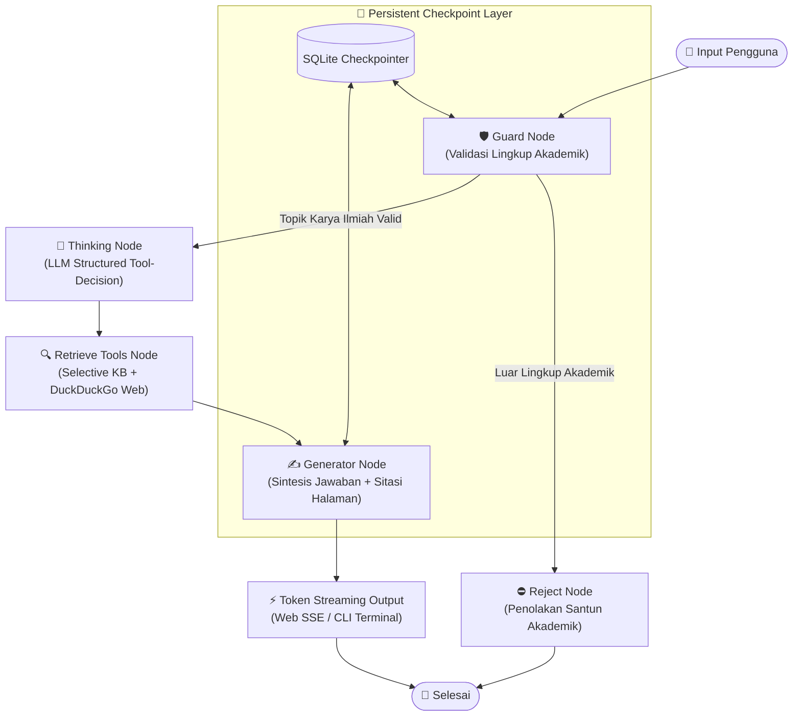

# Agentic Architect Challenge — Developer Intern Assessment

<div align="center">

[](https://www.python.org/)
[](https://github.com/langchain-ai/langgraph)
[](https://ai.google.dev/)
[](https://fastapi.tiangolo.com/)
[](https://playwright.dev/)
[-success.svg)](part-3/tests)
[](LICENSE)

<p align="center">
  <strong>Repositori teknis komprehensif untuk pengujian seleksi Developer Intern / Agentic Architect Challenge.</strong><br>
  Mencakup perancangan arsitektur agen customer support berkeandalan tinggi, implementasi web scraper adaptif dengan guardrail panjang ringkasan, serta agen AI otonom berbasis State Machine LangGraph dengan memori persisten SQLite dan antarmuka ganda (Web UI + CLI).
</p>

<p align="center">
  <a href="#-navigasi-cepat-komponen">Navigasi Bagian</a> •
  <a href="#-arsitektur--ikhtisar-solusi">Ikhtisar Solusi</a> •
  <a href="#-matriks-kriteria-evaluasi">Kriteria Evaluasi</a> •
  <a href="#-panduan-instalasi--menjalankan-proyek">Panduan Instalasi</a> •
  <a href="#-pengujian-otomatis-unit-tests">Pengujian Otomatis</a>
</p>

</div>

---

## 📋 Daftar Isi

1. [Navigasi Cepat Komponen](#-navigasi-cepat-komponen)
2. [Ikhtisar Tantangan & Ringkasan Solusi](#-ikhtisar-tantangan--ringkasan-solusi)
   - [Part 1: Customer Support Email Agent (System Design & Critical Thinking)](#part-1-customer-support-email-agent-system-design--critical-thinking)
   - [Part 2: Web Scraper & Content Summarizer (Technical Implementation)](#part-2-web-scraper--content-summarizer-technical-implementation)
   - [Part 3: Asisten Penulisan Karya Ilmiah UM (Practical Evaluation)](#part-3-asisten-penulisan-karya-ilmiah-um-practical-evaluation)
3. [Matriks Kriteria Evaluasi](#-matriks-kriteria-evaluasi)
4. [Peta Struktur Direktori Repositori](#-peta-struktur-direktori-repositori)
5. [Panduan Instalasi & Menjalankan Proyek](#-panduan-instalasi--menjalankan-proyek)
   - [Prasyarat Sistem](#1-prasyarat-sistem)
   - [Konfigurasi Virtual Environment & API Key](#2-konfigurasi-virtual-environment--api-key)
   - [Menjalankan Part 2 (Web Scraper & Summarizer)](#3-menjalankan-part-2-web-scraper--summarizer)
   - [Menjalankan Part 3 (Asisten AI Penulisan Karya Ilmiah)](#4-menjalankan-part-3-asisten-ai-penulisan-karya-ilmiah)
6. [Pengujian Otomatis (Unit Tests)](#-pengujian-otomatis-unit-tests)
7. [Kepatuhan Terhadap Panduan Submisi](#-kepatuhan-terhadap-panduan-submisi)

---

## 🧭 Navigasi Cepat Komponen

| Bagian | Fokus Tantangan | File Utama / Dokumentasi | Sorotan Solusi |
| :--- | :--- | :--- | :--- |
| **[Part 1](Part-1/)** | *System Design & Critical Thinking* | • [`Part-1/README.md`](Part-1/README.md)<br>• [`Part-1/email_agent_architecture.svg`](Part-1/email_agent_architecture.svg) | Pre-draft critical routing (Data loss, Outage, Breach, >3 kontak/7 hari), Grounded KB RAG, Anti-hallucination refund guardrail. |
| **[Part 2](Part-2/)** | *Technical Implementation* | • [`Part-2/web_scraper.py`](Part-2/web_scraper.py)<br>• [`Part-2/README.md`](Part-2/README.md) | Hybrid scraping (`Requests` + `Playwright` fallback), sliding-window chunking, fact-extraction map-reduce, programmatic word guardrail (100–250 kata). |
| **[Part 3](part-3/)** | *Practical Evaluation* | • [`part-3/app.py`](part-3/app.py) (CLI)<br>• [`part-3/web_app.py`](part-3/web_app.py) (FastAPI)<br>• [`part-3/README.md`](part-3/README.md) | State Machine LangGraph DAG, SQLite persistent checkpointer, dynamic tool decision (`Pydantic`), 134 halaman BM25 KB retrieval, DuckDuckGo search, time-awareness. |

---

## 🏛️ Arsitektur & Ikhtisar Solusi

### Part 1: Customer Support Email Agent (System Design & Critical Thinking)
> **Dokumentasi Lengkap**: [`Part-1/README.md`](Part-1/README.md) | **Diagram SVG**: [`Part-1/email_agent_architecture.svg`](Part-1/email_agent_architecture.svg)

Solusi arsitektur agen email customer support yang memprioritaskan mitigasi risiko dan kendali manusia:

```text
                     CUSTOMER SUPPORT EMAIL
                               |
                               v
                     +--------------------+
                     |  Email Ingestion   |
                     +--------------------+
                               |
                               v
                  +--------------------------+
                  |  CRITICAL ISSUE CHECK    |  <-- Pengecekan SEBELUM drafting
                  |  - Data loss             |
                  |  - Service outage        |
                  |  - Security breach       |
                  |  - >3 contacts in 7 days |
                  +--------------------------+
                             /        \
                           YES         NO
                            |           |
                            v           v
                       HUMAN AGENT   CLASSIFIER (Billing, Technical, Feedback)
                                        |
                                        v
                               INTERNAL KNOWLEDGE BASE (PDF / FAQ)
                                        |
                                        v
                               GROUNDED DRAFTING
                                        |
                                        v
                               POLICY & REFUND GUARDRAIL
                                 (Strict Zero-Hallucination)
                                        |
                                        v
                               HUMAN REVIEW / DISPATCH
```

#### Keunggulan Arsitektur:
1. **Pre-Drafting Escalation**: Email yang menyangkut kerentanan keamanan (*security breach*), pemadaman layanan (*outage*), kehilangan data (*data loss*), atau eskalasi frekuensi tinggi (>3 kali kontak dalam 7 hari) langsung dialihkan ke agen manusia tanpa menghasilkan draft otomatis yang berisiko.
2. **Zero-Hallucination Policy Guardrail**: Draft jawaban terikat murni (*grounded*) pada knowledge base internal. Pertanyaan terkait refund yang tidak tertera pada dokumen kebijakan dilarang dijawab dengan asumsi eksternal, melainkan diarahkan ke eskalasi manual.
3. **Observability & Reliability**: Dilengkapi metrik penelusuran (akurasi klasifikasi, *escalation rate*, *retrieval hit-ratio*, latensi pemrosesan) dan mekanisme *fail-safe* jika retrieval gagal.

---

### Part 2: Web Scraper & Content Summarizer (Technical Implementation)
> **Dokumentasi Lengkap**: [`Part-2/README.md`](Part-2/README.md) | **Source Code**: [`Part-2/web-scraper.py`](Part-2/web-scraper.py)

Mengatasi kelemahan skrip scraping konvensional terhadap halaman dinamis berbasis JavaScript, dokumen teks panjang, dan output model yang tidak terukur:

```text
Input URL 
   ├──> 1. Scrape via Requests (Cepat & Ringan)
   │        └── Evaluasi teks dominan (<article>, <main>, <body>)
   │
   └──> 2. Playwright Fallback (Halaman SPA / Dinamis / JavaScript-rendered)
            └── Ekstraksi teks DOM bersih (buang script, nav, style, form, footer)
   │
   v
Panjang Konten?
   ├── 1 Chunk  ──> Langsung diringkas berbasis konteks penuh
   └── >1 Chunk ──> Sliding-window chunking ──> Ekstraksi fakta per chunk ──> Sintesis akhir
   │
   v
Summary Guardrail (Programmatic Validator)
   ├── Cek Jumlah Kata (Min: 100 kata, Target: 150–220 kata, Max: 250 kata)
   ├── Cek Struktur Markdown (Inti Sari Utama, Poin Fakta, Latar Belakang)
   └── Regenerasi otomatis jika batas tidak terpenuhi (Maksimal 3x retry dengan backoff)
   │
   v
Output Terstruktur & Ringkas
```

#### Keunggulan Implementasi:
- **Resilient Fallback**: Memulai scraping via HTTP `Requests` demi efisiensi resource; secara otomatis mengaktifkan *headless browser* `Playwright (Chromium)` jika konten tidak ditemukan atau bersifat dinamis.
- **Hierarchical Fact Map-Reduce**: Menghilangkan batasan konteks token dan mencegah fenomena *loss in the middle* pada artikel panjang.
- **Enforced Guardrail**: Validasi ganda (instruksi prompt terstruktur + validasi programatis jumlah kata) untuk menjamin keluaran tidak bertele-tele maupun terlalu singkat.

---

### Part 3: Asisten Penulisan Karya Ilmiah UM (Practical Evaluation)
> **Dokumentasi Lengkap**: [`part-3/README.md`](part-3/README.md) | **Web Server**: [`part-3/web_app.py`](part-3/web_app.py) | **CLI**: [`part-3/app.py`](part-3/app.py)

Agen otonom berbasis State Machine LangGraph yang berakar pada dokumen resmi **Pedoman Penulisan Karya Ilmiah Universitas Negeri Malang (134 Halaman, UM Press 2017)**:



#### Keunggulan Implementasi:
1. **Agentic Reasoning via Structured Output**: `thinking_node` menggunakan skema `Pydantic` terstruktur untuk memutuskan kebutuhan pemanggilan dokumen internal (`need_kb`) dan penelusuran web komplementer (`need_web`) secara adaptif, bukan pencocokan *regex* kaku.
2. **Polite Guardrail**: Menyaring topik di luar penulisan karya ilmiah dengan respon penolakan santun akademik yang mengarahkan kembali pengguna tanpa membuang kuota LLM pada tool execution.
3. **Kesadaran Waktu Dinamis (*Time-Awareness*)**: Menghitung otomatis tahun akademik berjalan dan batasan kemutakhiran literatur ilmiah 10 tahun terakhir secara tepat.
4. **Persistent Conversation Memory**: Didukung basis data SQLite checkpointer (`storage/checkpoint.db`), menjaga konteks multi-turn antar sesi konsultasi.
5. **Antarmuka Ganda & Identitas Resmi UM**: Web UI modern bertema resmi UM (Biru UM, Hijau Kalpataru, Kuning Emas) dengan real-time *Server-Sent Events* (SSE) token streaming serta CLI konsol interaktif.

---

## 📊 Matriks Kriteria Evaluasi

Penilaian tantangan dievaluasi berdasarkan 4 pilar utama:

| Pilar Evaluasi | Implementasi pada Part 1 | Implementasi pada Part 2 | Implementasi pada Part 3 |
| :--- | :--- | :--- | :--- |
| **1. System Reliability** | • Pre-drafting critical check.<br>• Escalation fallback jika retrieval kosong.<br>• Proteksi refund policy. | • Scraper ganda (`Requests` + `Playwright` fallback).<br>• Retry exponential backoff pada API error (429/503). | • Safe fallback saat web search gagal.<br>• Fallback LLM temperature & structured output parser.<br>• SQLite error-resilience. |
| **2. Code Quality** | • Pemisahan modular router, knowledge base, validator, & drafter.<br>• Type hints terdefinisi rapi. | • Clean code, modular function separation.<br>• DOM cleaning efisien & targeted container prioritization. | • Pemisahan node-based modular (`src/nodes/`, `src/tools/`).<br>• Typing Pydantic & state dataclass.<br>• 26 unit tests mencakup seluruh modul. |
| **3. Agentic Logic** | • Pola decision-tree berbasis status risiko & intent categorization. | • Content chunking & dynamic fact-extraction map-reduce. | • LangGraph conditional state graph branching.<br>• LLM autonomous tool decision.<br>• Contextual history awareness. |
| **4. Operational Thinking** | • Spesifikasi skema logging detail.<br>• Monitoring metrik latensi, escalation rate, & drift. | • Programmatic summary length guardrail (100–250 kata).<br>• Logging tahap ekstraksi. | • SQLite memory checkpointing.<br>• Streaming latency optimisasi (<0.8s TTFT).<br>• Comprehensive test suite otomatis. |

---

## 📁 Peta Struktur Direktori Repositori

```text
assesment/
├── Agentic Architect Challenge for Developer Intern Test.pdf  # Dokumen soal resmi
├── README.md                                                  # Master README (Dokumen ini)
│
├── Part-1/                                                    # PART 1: System Design
│   ├── README.md                                              # Dokumentasi sistem & mitigasi risiko
│   └── email_agent_architecture.svg                           # Diagram arsitektur visual
│
├── Part-2/                                                    # PART 2: Technical Implementation
│   ├── README.md                                              # Dokumentasi scraping & guardrail
│   ├── web_scraper.py                                         # Skrip scraper adaptif & summarizer (CLI runner)
│   ├── web-scraper.py                                         # Wrapper kompatibilitas
│   ├── requirements.txt                                       # Dependensi pustaka Part 2
│   └── .env.example                                           # Templat API key Part 2
│
└── part-3/                                                    # PART 3: Practical Evaluation
    ├── README.md                                              # Dokumentasi lengkap asisten karya ilmiah
    ├── Pedoman-Penulisan-Karya-Ilmiah-2017.pdf                # Dokumen pedoman resmi 134 halaman
    ├── app.py                                                 # Antarmuka interaktif terminal CLI
    ├── web_app.py                                             # Server FastAPI Web UI & endpoint SSE
    ├── requirements.txt                                       # Dependensi pustaka Python
    ├── .env.example                                           # Templat konfigurasi API Key
    │
    ├── src/                                                   # Core Agent Architecture
    │   ├── config.py                                          # Pengaturan path, Gemini model, & env
    │   ├── graph.py                                           # Konstruksi StateGraph LangGraph & routing
    │   ├── state.py                                           # Skema state AcademicAgentState
    │   ├── memory.py                                          # Checkpointer SQLite persisten
    │   ├── ocr_pipeline.py                                    # Ekstraksi teks PyMuPDF / OCR naskah
    │   ├── utils.py                                           # Utility teks & kesadaran waktu
    │   ├── nodes/                                             # Node-node LangGraph
    │   │   ├── guard.py                                       # Guardrail penolakan santun
    │   │   ├── thinking.py                                    # Reasoning & penentuan tool otomatis
    │   │   ├── tools_node.py                                  # Eksekutor tool selektif
    │   │   └── generator.py                                   # Generator jawaban + sitasi naskah
    │   └── tools/                                             # Toolkit agen
    │       ├── kb_search.py                                   # BM25 temu kembali pedoman UM
    │       └── web_search.py                                  # DuckDuckGo web search
    │
    ├── templates/                                             # Tampilan Web UI (Jinja2)
    │   └── index.html                                         # Antarmuka bertema resmi UM
    ├── static/                                                # Aset statis antarmuka
    │   ├── css/um-style.css                                   # Styling resmi Biru UM & Hijau Kalpataru
    │   ├── js/app.js                                          # Logika client SSE streaming & sesi
    │   └── img/Lambang-UM.png                                 # Lambang resmi Universitas Negeri Malang
    ├── storage/                                               # Persistensi basis data
    │   └── checkpoint.db                                      # Database SQLite riwayat obrolan
    └── tests/                                                 # Rangkaian pengujian otomatis
        ├── test_graph_flow.py                                 # Uji orkestrasi alur graph
        ├── test_guardrail.py                                  # Uji filter santun non-akademik
        ├── test_kb_search.py                                  # Uji penelusuran pedoman 134 halaman
        ├── test_thinking_reasoning.py                         # Uji penalaran LLM tool-decision
        ├── test_time_awareness.py                             # Uji batas 10 tahun kemutakhiran
        ├── test_web_api.py                                    # Uji endpoint FastAPI & SSE
        └── test_web_search.py                                 # Uji penelusuran web
```

---

## 🚀 Panduan Instalasi & Menjalankan Proyek

### 1. Prasyarat Sistem
- **Python 3.10** atau versi yang lebih baru terpasang di sistem.
- **Google Gemini API Key** (dapat diperoleh gratis melalui [Google AI Studio](https://aistudio.google.com/)).

---

### 2. Konfigurasi Virtual Environment & API Key

Buka terminal pada root repositori ini:

```bash
# 1. Buat dan aktifkan virtual environment
python -m venv .venv

# Untuk Windows PowerShell:
.venv\Scripts\Activate.ps1
# Untuk Linux/macOS:
# source .venv/bin/activate

# 2. Pasang paket dependensi dari Part 3
pip install -r part-3/requirements.txt

# 3. Pasang browser Playwright (untuk Part 2)
playwright install chromium
```

Salin konfigurasi environment:
```bash
# Salin contoh konfigurasi env ke part-3
cp part-3/.env.example part-3/.env
```
Isi kunci API pada `part-3/.env`:
```env
GEMINI_API_KEY=AIzaSy...kunci_gemini_anda
GEMINI_MODEL=gemini-flash-lite-latest
```

---

### 3. Menjalankan Part 2 (Web Scraper & Summarizer)

Untuk menjalankan pengujian scraping dan peringkasan artikel web:

```bash
# Pindah ke direktori Part-2
cd Part-2

# Jalankan skrip scraper & summarizer (URL demo bawaan atau kustom)
python web_scraper.py
# Atau dengan URL kustom: python web_scraper.py "<url>"
```

Skrip akan mengeksekusi URL uji coba, mendemonstrasikan pembersihan DOM, mekanisme fallback jika diperlukan, ekstraksi fakta, serta memvalidasi bahwa ringkasan akhir mematuhi batas 100–250 kata dengan format terstruktur.

---

### 4. Menjalankan Part 3 (Asisten AI Penulisan Karya Ilmiah)

Proyek Part 3 menyediakan 2 pilihan antarmuka:

#### Opsi A: Antarmuka Web Interaktif (Direkomendasikan)
Menyajikan UI modern bertema resmi Universitas Negeri Malang dengan fitur *real-time token streaming*:

```bash
# Pindah ke folder part-3
cd part-3

# Jalankan server web FastAPI
python web_app.py
```
Buka browser Anda dan akses: 👉 **[http://127.0.0.1:8000](http://127.0.0.1:8000)**

#### Opsi B: Antarmuka Konsol CLI
Bagi eksekusi cepat melalui terminal dengan dukungan perintah sesi:

```bash
cd part-3
python app.py
```
*Perintah bantuan CLI yang tersedia:*
- `/new` — Membuat sesi konsultasi baru.
- `/thread <id>` — Membuka kembali memori sesi sebelumnya dari SQLite.
- `/pedoman <kueri>` — Menelusuri naskah pedoman UM secara instan.
- `/web <kueri>` — Menelusuri web eksternal.
- `/keluar` — Mengakhiri sesi terminal.

---

## 🧪 Pengujian Otomatis (Unit Tests)

Seluruh logika arsitektur agen pada Part 3 diuji secara menyeluruh menggunakan `unittest`:

```bash
# Dari root repositori:
python -m unittest discover part-3/tests

# Atau dari folder part-3:
cd part-3 && python -m unittest discover tests
```

### Hasil Rangkaian Pengujian:
```text
..........................
----------------------------------------------------------------------
Ran 26 tests in 15.467s

OK
```

Cakupan pengujian otomatis meliputi:
- ✅ **`test_guardrail.py`**: Memastikan topik non-akademik ditolak secara santun tanpa memicu pemanggilan tool.
- ✅ **`test_thinking_reasoning.py`**: Memvalidasi ketepatan penalaran LLM dalam memilih pemanggilan `need_kb` dan `need_web` dengan skema terstruktur.
- ✅ **`test_kb_search.py`**: Memverifikasi akurasi penelusuran naskah pedoman 134 halaman dan sitasi bab/halaman.
- ✅ **`test_time_awareness.py`**: Memvalidasi kalkulasi otomatis rentang 10 tahun kemutakhiran pustaka ilmiah.
- ✅ **`test_graph_flow.py`**: Menguji transisi antar node StateGraph LangGraph dan penyimpanan riwayat obrolan.
- ✅ **`test_web_api.py`**: Menguji kepatuhan antarmuka web, endpoint FastAPI, dan streaming SSE.
- ✅ **`test_web_search.py`**: Menguji fungsi pencarian web komplementer DuckDuckGo.

---

## 📄 Kepatuhan Terhadap Panduan Submisi

| Panduan Submisi Resmi | Status Kepatuhan | Lokasi Referensi |
| :--- | :---: | :--- |
| **Link GitHub repository berisi kode & dokumentasi** | ✅ Tercakup | Repositori ini memuat seluruh kode sumber Part 1, Part 2, dan Part 3 beserta dokumentasi lengkap. |
| **Dokumen PDF 1 halaman arsitektur, trade-offs, & mitigasi** | 📄 Siap Diserahkan | Penjelasan komprehensif mengenai desain arsitektur, rekayasa trade-offs, dan mitigasi titik kegagalan telah tercakup lengkap di dokumentasi dan siap diekspor ke format PDF untuk submisi/presentasi wawancara. |
| **Instruksi menjalankan environment lokal (dependensi, API key)** | ✅ Tercakup | Panduan terpadu pada bagian [Panduan Instalasi](#-panduan-instalasi--menjalankan-proyek). |
| **Kesiapan presentasi arsitektur saat wawancara** | ✅ Tercakup | Dilengkapi diagram SVG arsitektur, diagram alir mermaid, serta pemetaan kriteria evaluasi teknis. |

---

<div align="center">
  <sub>Dibuat dengan dedikasi untuk memenuhi <strong>Agentic Architect Challenge &bull; Developer Intern Test</strong></sub>
</div>
