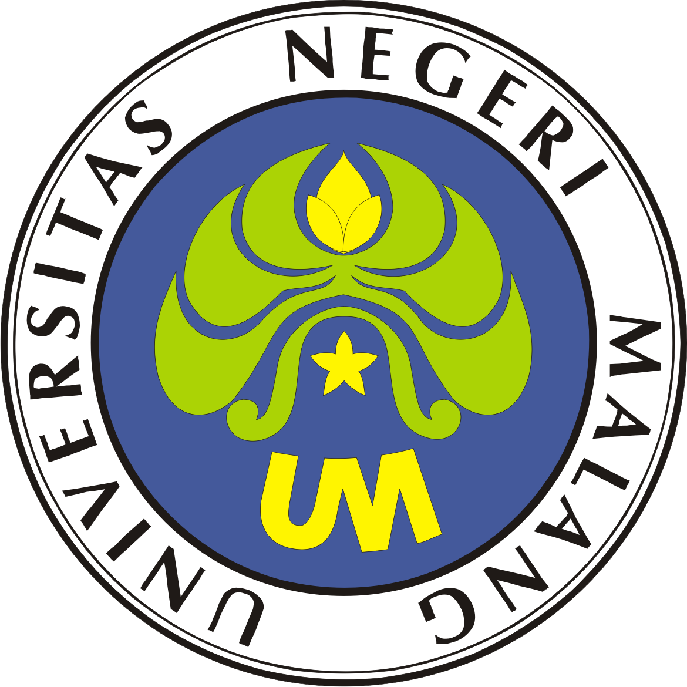
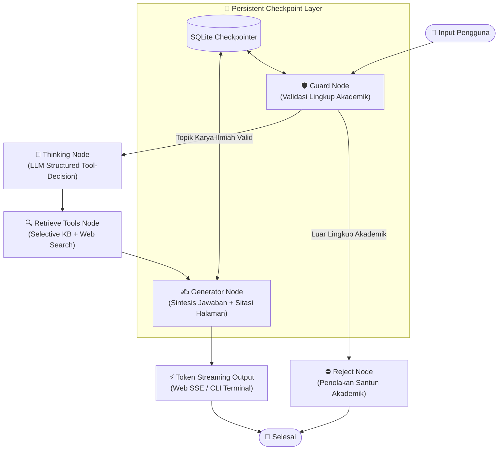

<div align="center">

  

  # Asisten Cerdas Penulisan Karya Ilmiah
  ### **Universitas Negeri Malang (UM Press 2017)**

  [](https://www.python.org/)
  [](https://github.com/langchain-ai/langgraph)
  [](https://ai.google.dev/)
  [](https://fastapi.tiangolo.com/)
  [-success.svg)](tests)
  [](LICENSE)

  <p align="center">
    <strong>Sistem AI Agent otonom berbasis State Machine LangGraph yang ditenagai Google Gemini API, dirancang khusus untuk mendampingi sivitas akademika Universitas Negeri Malang dalam menyusun Skripsi, Tesis, Disertasi, Makalah, dan Artikel Ilmiah sesuai standar dokumen resmi UM Press 2017.</strong>
  </p>

  <p align="center">
    <a href="../README.md">⬅️ Kembali ke Repositori Utama</a> •
    <a href="#-alur--panduan-penggunaan">Panduan Penggunaan</a> •
    <a href="#-arsitektur-sistem-langgraph">Arsitektur Agen</a> •
    <a href="#-fitur-utama">Fitur Utama</a> •
    <a href="#-instalasi--konfigurasi-cepat">Instalasi</a> •
    <a href="#-pengujian-otomatis-unit-tests">Pengujian</a>
  </p>

</div>

---

## 📋 Daftar Isi
1. [Tentang Proyek](#-tentang-proyek)
2. [Fitur Utama](#-fitur-utama)
3. [Arsitektur Sistem (LangGraph Workflow)](#-arsitektur-sistem-langgraph)
4. [Identitas Visual & Palet Warna Resmi UM](#-identitas-visual--palet-warna-resmi-um)
5. [Instalasi & Konfigurasi Cepat](#-instalasi--konfigurasi-cepat)
6. [Alur & Panduan Penggunaan](#-alur--panduan-penggunaan)
   - [Opsi A: Web UI Modern (Direkomendasikan)](#opsi-a-web-ui-modern-interaktif-direkomendasikan)
   - [Opsi B: CLI Terminal Interaktif](#opsi-b-cli-terminal-interaktif)
7. [Contoh Studi Kasus Percakapan](#-contoh-studi-kasus-percakapan)
8. [Struktur Direktori Proyek](#-struktur-direktori-proyek)
9. [Pengujian Otomatis (Unit Tests)](#-pengujian-otomatis-unit-tests)
10. [Lisensi & Atribusi](#-lisensi--atribusi)

---

## 📖 Tentang Proyek

Penyusunan karya ilmiah di lingkungan perguruan tinggi menuntut kepatuhan ketat terhadap gaya selingkung institusional—mulai dari tata cara pengutipan langsung, format daftar rujukan, sistematika bab skripsi (alternatif 1, 2, atau 3), hingga aturan kemutakhiran pustaka. Ketidaksesuaian format sering kali menjadi kendala teknis yang menghambat proses bimbingan mahasiswa.

**Asisten Karya Ilmiah UM** hadir sebagai solusi cerdas berbasis kecerdasan buatan (*Agentic Workflow*) yang berlandaskan **Buku Pedoman Penulisan Karya Ilmiah Edisi 2017 terbitan UM Press** (134 halaman lengkap). Sistem ini tidak sekadar menjawab secara generik, melainkan:
- Menggali langsung pasal dan aturan resmi dari naskah pedoman UM Bab 1 s.d. Bab 9 beserta lampirannya.
- Memiliki filter kesantunan akademik (*polite guardrail*) yang menyaring pertanyaan non-akademik secara santun.
- Memiliki kesadaran waktu (*time-awareness*) secara mandiri untuk menghitung tahun akademik berjalan dan batas rentang 10 tahun kemutakhiran literatur ilmiah.
- Menyimpan konteks percakapan secara persisten antar sesi melalui basis data SQLite.

---

## ✨ Fitur Utama

| Fitur | Deskripsi |
| :--- | :--- |
| **🧠 Agentic Reasoning (LangGraph)** | Alur penalaran otonom berbasis State Machine dengan pengambilan keputusan tool berbasis LLM Structured Output (`Pydantic`), bukan sekadar pencocokan kata kunci statis. |
| **⚡ Real-Time Streaming (SSE)** | Teks terketik halus (*Time-to-First-Token* < 0.8 detik) baik pada antarmuka Web UI maupun konsol CLI. |
| **📚 134 Halaman Basis Pengetahuan** | Teks pedoman resmi diekstraksi secara presisi dengan sistem temu kembali cepat berbasis *BM25 / keyword indexing*. |
| **🛡️ Polite Guardrail Filter** | Melindungi sistem dari *prompt injection* atau topik di luar penulisan karya ilmiah dengan kalimat penolakan yang santun dan mengarahkan kembali ke topik akademik. |
| **⏱️ Kesadaran Waktu Dinamis** | Mengetahui hari, tanggal, semester berjalan, dan menghitung otomatis rentang 10 tahun kemutakhiran referensi (misal: saat tahun 2026, literatur mutakhir adalah 2016–2026). |
| **💾 SQLite Checkpointer Memory** | Riwayat percakapan tidak hilang saat halaman disegarkan; pengguna dapat membuat banyak sesi konsultasi secara simultan. |
| **🎨 Web UI Bertema Resmi UM** | Antarmuka bergaya resmi portal UM dengan Lambang Resmi UM asli, palet warna Biru UM, Hijau Kalpataru, dan Kuning Emas. |
| **📖 Knowledge Base Drawer** | Panel samping penjelajah pedoman untuk membaca deskripsi Bab 1 s.d. Bab 9 serta mencari kata kunci langsung ke halaman naskah. |

---

## 🏛️ Arsitektur Sistem (LangGraph)

Agent ini dirancang menggunakan arsitektur **Directed Acyclic Graph (DAG)** bersyarat yang mengalirkan state `AcademicAgentState`:



### Rincian Komponen Node:
1. **`guard_node`** (`src/nodes/guard.py`): Menganalisis niat pengguna. Jika pertanyaan berkaitan dengan skripsi, tesis, makalah, rujukan, format tulisan, atau administrasi penulisan, maka dialirkan ke `thinking_node`.
2. **`reject_node`** (`src/nodes/guard.py`): Memberikan penjelasan ramah bahwa asisten difokuskan mendampingi penulisan karya ilmiah Universitas Negeri Malang.
3. **`thinking_node`** (`src/nodes/thinking.py`): Modul penalaran otonom (*Agentic Reasoning*) berbasis LLM Structured Output (`Pydantic ToolDecision`). LLM secara mandiri memutuskan apakah memerlukan dokumen pedoman (`need_kb`) dan/atau web eksternal (`need_web`), serta merumuskan kueri pencarian yang padat dan spesifik (bukan sekadar menyalin pertanyaan mentah atau pemicu kata kunci kaku). Sapaan santun dan obrolan umum dilewati tanpa *retrieval* yang sia-sia.
4. **`retrieve_tools_node`** (`src/nodes/tools_node.py`): Menjalankan pemanggilan tool secara selektif sesuai keputusan boolean `need_kb` dan `need_web` hasil penalaran LLM.
5. **`generator_node`** (`src/nodes/generator.py`): Menyusun jawaban komprehensif, mencantumkan nomor bab/halaman buku pedoman, serta mematuhi aturan kemutakhiran literatur 10 tahun.

---

## 🎨 Identitas Visual & Palet Warna Resmi UM

Sistem mengadopsi elemen dan filosofi lambang resmi [Universitas Negeri Malang](https://um.ac.id/):

<div align="center">

| Elemen Lambang | Kode Hex | Filosofi & Penerapan Visual |
| :---: | :---: | :--- |
| **Biru UM** | `#44599B` / `#16244D` | Melambangkan kestabilan, kedalaman ilmu pengetahuan, dan kematangan institusi akademik. Digunakan pada navbar header, tombol utama, blok kode, dan header tabel. |
| **Hijau Kalpataru** | `#ABD305` / `#F4FADC` | Warna daun pohon Kalpataru pada lambang UM, melambangkan pertumbuhan, kelestarian wawasan lingkungan, dan keberlanjutan. Digunakan pada aksen border, status sesi aktif, tag *The Learning University*, dan kutipan. |
| **Kuning Emas** | `#FFF500` / `#FDB913` | Warna kuncup Tri Dharma dan bintang Pancasila, melambangkan kejayaan dan keluhuran budi. Digunakan pada tombol *Jelajah Pedoman*, ikon aksi, dan kursor animasi *streaming*. |

</div>

---

## 🚀 Instalasi & Konfigurasi Cepat

### 1. Prasyarat Sistem
- Python 3.10 atau versi yang lebih baru.
- Sistem Operasi: Windows, macOS, atau Linux.
- Kunci API Google Gemini (dapat diperoleh gratis di [Google AI Studio](https://aistudio.google.com/)).

### 2. Kloning & Pemasangan Dependensi
Buka terminal dan pasang pustaka yang diperlukan:
```bash
# Dari root repositori assesment, pindah ke direktori part-3:
cd part-3

# Pasang paket dependensi
pip install -r requirements.txt
```

### 3. Konfigurasi Kunci API (`.env`)
Salin file `.env.example` menjadi `.env` lalu masukkan kunci API Anda:
```bash
cp .env.example .env
```
Isi berkas `.env`:
```env
GEMINI_API_KEY=AIzaSy...your_gemini_api_key_here
GEMINI_MODEL=gemini-flash-lite-latest
```
*(Catatan: Jika berkas `.env` belum diisi, aplikasi CLI secara otomatis akan meminta input kunci API saat pertama kali dijalankan dan menyimpannya untuk Anda).*

---

## 💻 Alur & Panduan Penggunaan

Sistem menyediakan dua antarmuka independen yang dapat disesuaikan dengan kebutuhan Anda:

### Opsi A: Web UI Modern Interaktif (Direkomendasikan)

Antarmuka web modern dengan tata letak responsif, drawer pedoman, dan streaming token waktu nyata.

1. **Jalankan Server Web**:
   ```powershell
   python web_app.py
   ```
2. **Akses di Browser**:
   Buka alamat: 👉 **[http://127.0.0.1:8000](http://127.0.0.1:8000)**

```
┌────────────────────────────────────────────────────────────────────────────┐
│ [Logo UM] UNIVERSITAS NEGERI MALANG (The Learning University) [Jelajah UM] │
├───────────────┬────────────────────────────────────────────────────────────┤
│ [+ Sesi Baru] │ [Sesi Aktif: sesi-a1b2c3]          [Basis Data: 134 Hlm]   │
│               │                                                            │
│ Topik Populer:│  Anda: Bagaimana format kutipan langsung >= 40 kata?       │
│ • Kutipan     │                                                            │
│ • Skripsi     │  Asisten UM:                                               │
│ • Rujukan     │  Berdasarkan Pedoman Penulisan Karya Ilmiah UM 2017 Bab 5: │
│               │  1. Kutipan diketik terpisah dari teks utama               │
│ Riwayat Sesi: │  2. Diberi jarak spasi tunggal (1 spasi)                   │
│ • sesi-a1b2c3 │  3. Menjorok 5 ketukan dari garis margin kiri...           │
│ • sesi-9f8e7d │                                                            │
├───────────────┴────────────────────────────────────────────────────────────┤
│ [ Ketik pertanyaan seputar karya ilmiah...                     ] [ Kirim ] │
└────────────────────────────────────────────────────────────────────────────┘
```

#### Fitur Utama Web UI:
- **Streaming Halus**: Respon diketik secara langsung (*word-by-word streaming*) menggunakan SSE (*Server-Sent Events*).
- **Drawer Penjelajah Pedoman**: Klik tombol emas **"Jelajah Pedoman UM"** di pojok kanan atas untuk melihat intisari Bab 1 s.d. Bab 9 atau mencari kutipan pasal secara cepat.
- **Salin Sekali Klik**: Tombol *Salin* di setiap balon asisten memudahkan mengutip format langsung ke naskah skripsi Anda.
- **Manajemen Sesi Persisten**: Buat sesi konsultasi baru dengan tombol `+ Sesi Konsultasi Baru` atau hapus riwayat sesi yang sudah tidak diperlukan.

---

### Opsi B: CLI Terminal Interaktif

Bagi pengguna yang menyukai antarmuka konsol berkecepatan tinggi tanpa browser.

1. **Jalankan Skrip Terminal**:
   ```powershell
   python app.py
   ```
2. **Daftar Perintah Konsol Khusus**:

| Perintah | Fungsi | Contoh Penggunaan |
| :--- | :--- | :--- |
| `/new` | Memulai percakapan baru dengan ID sesi baru | `/new` |
| `/thread <id>` | Membuka kembali memori sesi sebelumnya | `/thread sesi-d39a1f` |
| `/pedoman <q>` | Menelusuri naskah pedoman UM secara instan | `/pedoman kutipan langsung` |
| `/web <q>` | Mencari informasi rujukan komplementer di web | `/web gaya selingkung APA edisi 7` |
| `/keluar` | Keluar dari aplikasi terminal | `/keluar` |

---

## 💡 Contoh Studi Kasus Percakapan

### 1. Aturan Pengutipan Langsung $\ge$ 40 Kata
> **Pengguna**: *"Bagaimana cara menulis kutipan langsung yang terdiri dari 40 kata atau lebih?"*
> 
> **Asisten**: Berdasarkan **Pedoman Penulisan Karya Ilmiah UM 2017 (Bab 5, Hlm. 28–29)**:
> 1. Kutipan ditulis terpisah dari teks yang mendahuluinya dalam blok tersendiri.
> 2. Diketik dengan **spasi tunggal (1 spasi)**.
> 3. Baris pertama dan baris berikutnya menjorok ke dalam sebanyak **5 ketukan (1 tab)** dari margin kiri.
> 4. Tidak diapit oleh tanda kutip ganda (`"..."`).
> 5. Sumber rujukan dicantumkan di akhir atau di awal kutipan lengkap dengan tahun dan halaman (contoh: *Anderson, 2015:45*).

---

### 2. Kesadaran Waktu & Batas Kemutakhiran Pustaka 10 Tahun
> **Pengguna**: *"Jika saya menyusun proposal skripsi sekarang, literatur yang mutakhir mencakup terbitan tahun berapa?"*
> 
> **Asisten**: Berdasarkan tanggal hari ini di **Tahun Akademik Berjalan**, ketentuan kemutakhiran pustaka bidang kependidikan/sosial/sains berpatokan pada **rentang maksimal 10 tahun terakhir**.
> - Literatur yang tergolong mutakhir mencakup karya yang diterbitkan dalam rentang **10 tahun terakhir**.
> - Prioritas rujukan primer (minimal 80%) disarankan bersumber dari artikel jurnal ilmiah bereputasi atau prosiding konferensi terkini.

---

### 3. Penolakan Santun Guardrail (Luar Lingkup)
> **Pengguna**: *"Tolong rekomendasikan bengkel motor terbaik di dekat gerbang Jl. Semarang Malang."*
> 
> **Asisten**: *"Mohon maaf, fokus layanan saya adalah mendampingi sivitas akademika Universitas Negeri Malang dalam penulisan karya ilmiah (seperti skripsi, tesis, artikel jurnal, makalah, dan format pengutipan). Silakan tanyakan hal seputar format naskah, kaidah bahasa ilmiah, atau sistematika penulisan karya ilmiah Anda."*

---

## 📁 Struktur Direktori Proyek

```text
part-3/
│
├── Pedoman-Penulisan-Karya-Ilmiah-2017.pdf  # Dokumen naskah resmi UM Press (134 Hlm)
├── app.py                                  # Antarmuka CLI interaktif berbasis terminal
├── web_app.py                              # Backend server FastAPI & endpoint streaming SSE
├── requirements.txt                        # Daftar dependensi pustaka Python
├── .env.example                            # Templat konfigurasi environment
├── README.md                               # Dokumentasi lengkap proyek
│
├── src/                                    # Sumber kode arsitektur Agent
│   ├── config.py                           # Konfigurasi path, LLM Gemini, dan env
│   ├── graph.py                            # Definisi StateGraph LangGraph & edge routing
│   ├── state.py                            # Skema status AcademicAgentState
│   ├── memory.py                           # Integrasi SQLite checkpoint persisten
│   ├── ocr_pipeline.py                     # Pipeline ekstraksi teks OCR (PyMuPDF/WinOCR)
│   ├── utils.py                            # Utility teks dan kalkulasi waktu akademik
│   │
│   ├── nodes/                              # Node-node LangGraph State Machine
│   │   ├── guard.py                        # Validasi niat pengguna & filter santun
│   │   ├── thinking.py                     # Perencana kata kunci penelusuran
│   │   ├── tools_node.py                   # Orkes eksekusi tools (Pedoman + Web)
│   │   └── generator.py                    # Penyusunan respons akademik & sitasi
│   │
│   └── tools/                              # Perangkat pendukung (Tools)
│       ├── kb_search.py                    # Temu kembali teks naskah Pedoman UM 2017
│       └── web_search.py                   # Penelusuran komplementer DuckDuckGo Search
│
├── templates/                              # Templat HTML (Jinja2)
│   └── index.html                          # Tampilan Web UI modern bertema resmi UM
│
├── static/                                 # Aset statis antarmuka
│   ├── css/
│   │   └── um-style.css                    # Variabel warna & gaya komponen akademik
│   ├── js/
│   │   └── app.js                          # Logika streaming SSE, sesi, dan drawer
│   └── img/
│       └── Lambang-UM.png                  # Lambang resmi Universitas Negeri Malang
│
├── storage/                                # Tempat penyimpanan persisten
│   └── checkpoint.db                       # Database SQLite riwayat sesi percakapan
│
└── tests/                                  # Rangkaian pengujian otomatis (Unit Tests)
    ├── test_graph_flow.py                  # Uji alur graph dan transisi antar node
    ├── test_guardrail.py                   # Uji penolakan santun topik non-akademik
    ├── test_kb_search.py                   # Uji akurasi pencarian naskah pedoman UM
    ├── test_thinking_reasoning.py          # Uji penalaran LLM tool-decision & skema terstruktur
    ├── test_time_awareness.py              # Uji logika tahun akademik & batas 10 tahun
    ├── test_web_api.py                     # Uji endpoint FastAPI, template, dan SSE
    └── test_web_search.py                  # Uji modul pencarian web komplementer
```

---

## 🧪 Pengujian Otomatis (Unit Tests)

Proyek ini dilengkapi dengan cakupan unit test otomatis untuk menjamin keandalan setiap modul:

Jalankan seluruh pengujian dengan satu perintah:
```powershell
# Jika berada di dalam folder part-3:
python -m unittest discover tests

# Atau jika berada di root repositori:
python -m unittest discover part-3/tests
```

### Hasil Uji Rangkaian:
```text
..........................
----------------------------------------------------------------------
Ran 26 tests in 15.467s

OK
```
Cakupan pengujian mencakup:
- **`test_thinking_reasoning.py`**: Memvalidasi penalaran LLM dalam menentukan pemanggilan naskah pedoman (`need_kb`) dan penelusuran web (`need_web`) secara terarah serta mekanisme fallback.
- **`test_guardrail.py`**: Memastikan pertanyaan non-akademik ditolak dengan santun tanpa memicu pemanggilan tool yang sia-sia.
- **`test_kb_search.py`**: Memverifikasi ketepatan ekstraksi pasal/bab pada naskah pedoman 134 halaman.
- **`test_time_awareness.py`**: Memvalidasi kalkulasi rentang tahun literatur mutakhir 10 tahun.
- **`test_graph_flow.py`**: Memeriksa orkestrasi pesan dan status penelusuran di dalam memori state.
- **`test_web_api.py`**: Menguji kepatuhan antarmuka web, keberadaan identitas visual UM, endpoint waktu, dan manajemen sesi.

---

## 📜 Lisensi & Atribusi

- **Naskah Pedoman**: Hak cipta isi *Pedoman Penulisan Karya Ilmiah Edisi 2017* sepenuhnya milik **Penerbit & Percetakan Universitas Negeri Malang (UM Press)**.
- **Lambang Institusi**: Lambang dan identitas visual resmi merupakan milik **Universitas Negeri Malang (um.ac.id)**.
- **Kode Sumber**: Dilisensikan di bawah [MIT License](LICENSE) untuk keperluan pengembangan riset dan pendampingan akademik.

<div align="center">
  <sub>Dikembangkan dengan dedikasi untuk sivitas akademika Universitas Negeri Malang &bull; The Learning University</sub>
</div>
